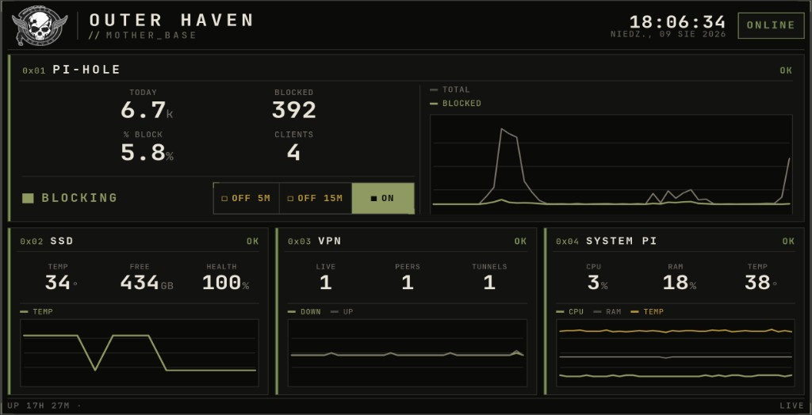

# Outer Haven Hub

Dashboard / kiosk for a Raspberry Pi home lab: Pi-hole, WireGuard, system metrics, and SSD SMART status on one screen.

Naming (`mother-base`, Outer Haven) is heavily inspired by Metal Gear.



**Stack:** Python 3 + FastAPI backend; vanilla HTML/CSS/JS frontend. Listens on `127.0.0.1` only.

## Local demo

Synthetic data; no Pi or live services required:

```bash
cd backend
python3 -m venv .venv && . .venv/bin/activate
pip install -r requirements.txt
HUB_DEMO=1 uvicorn main:app --host 127.0.0.1 --port 8090
```

Open: http://127.0.0.1:8090/

## Deploy

Production setup on a Raspberry Pi: [DEPLOY.md](DEPLOY.md).
